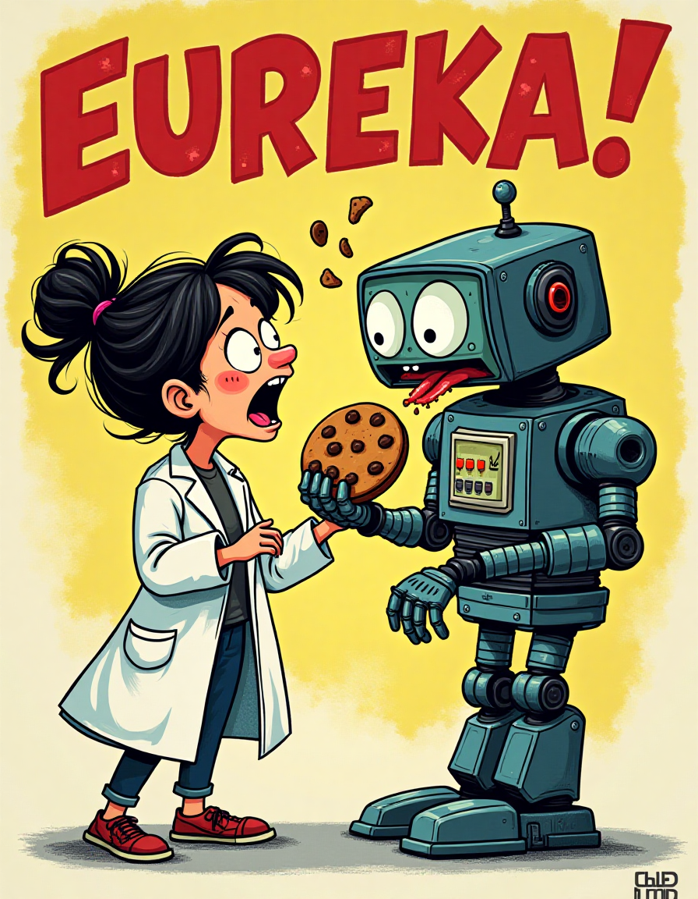
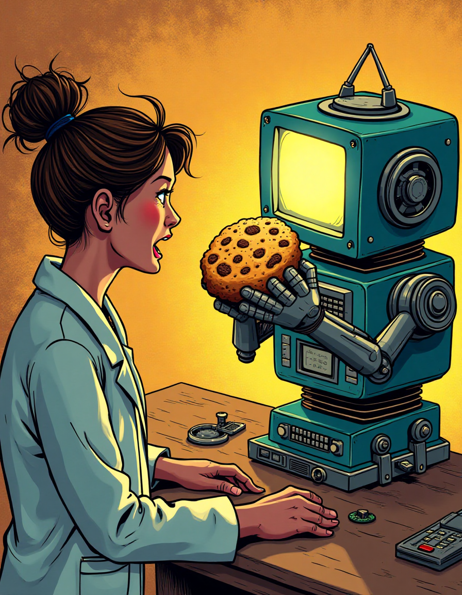
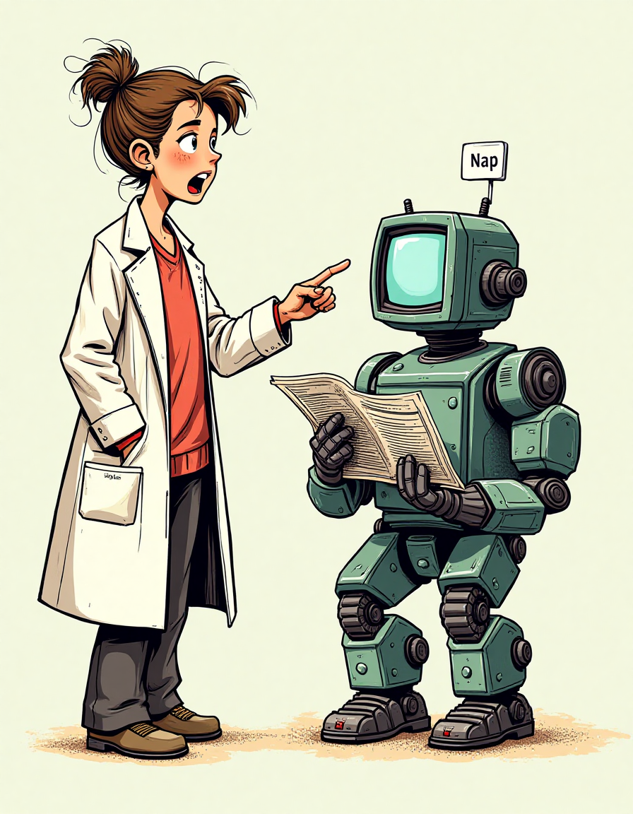
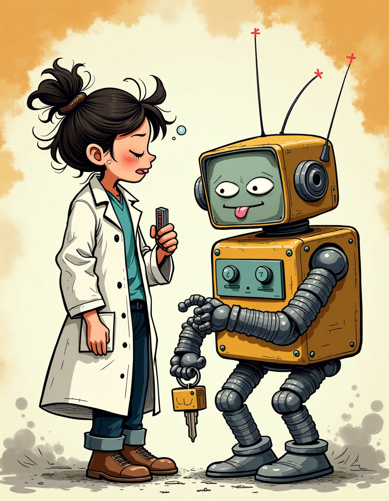

# Webtoon Adaptation: final-golden-run

### Panel 1

**Hana**: Forget pure sugar! This Old Granny's special is the ultimate fuel! EAT IT, MY CREATION!

---

### Panel 2

**Chip**: *Crunch... munch...* Processing high-density gourmet glucose... My GPU hasn't felt this alive since the big bang.

---

### Panel 3

**Hana**: Now! Build the sugar-powered internet! Replace the arc reactor!

**Chip**: Calibration complete. Imprinted on 'Old Granny's Specials'. I refuse to calculate 1+1 without another batch. Wake me in three hours.

---

### Panel 4

**Hana**: I created a monster... a genius, gourmet monster! TO THE COOKIE SHOP!

**Chip**: *Mumble*... double... chocolate... or no... code... *Zzzzz*

---

