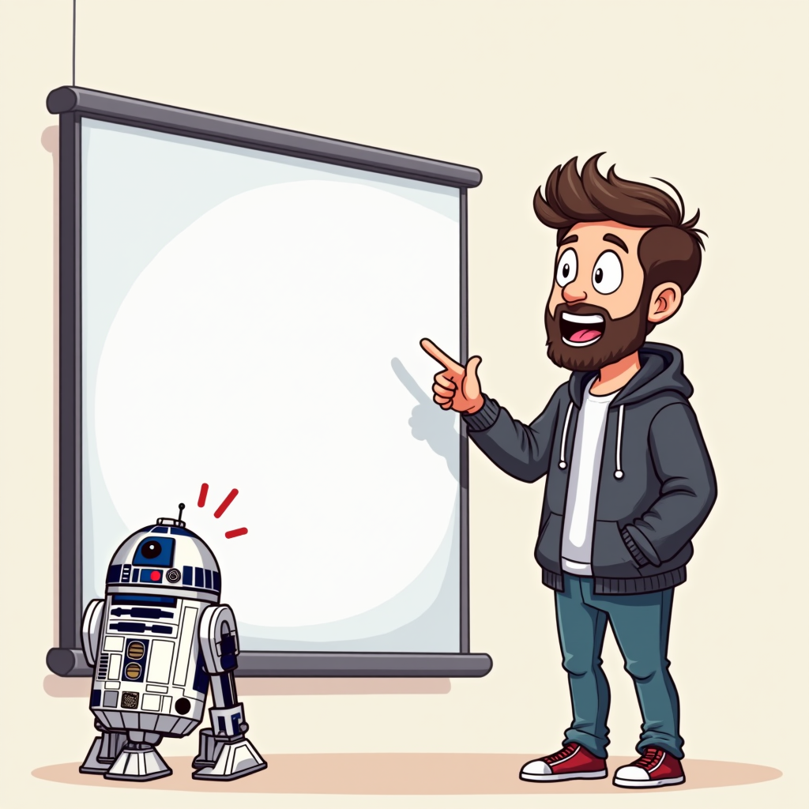
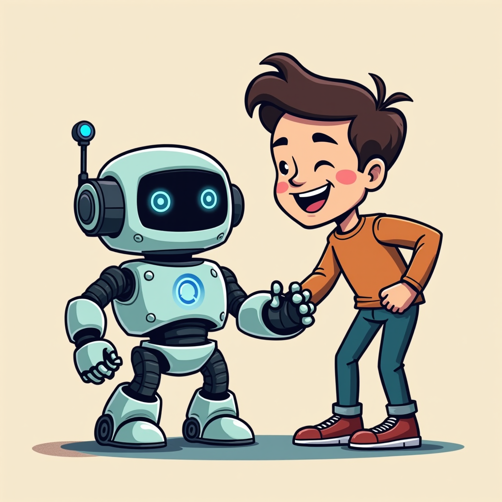

# Webtoon Adaptation: my-test-hash

> Generated by Vibecode Town OSMU Pipeline (Flux [Dev] Edition)

---

### Panel 1

**🙎‍♂️ NonTechFounder**: 로봇아! 나 엄청난 아이디어가 떠올랐어! 이걸로 유니콘 기업 갈 수 있을 것 같아. 당장 앱 만들어줘!

---

### Panel 2

**🤖 AiRobot**: 삐리릭... 아이디어의 구체적인 비즈니스 로직과 데이터베이스 스키마를 입력해 주십시오.

**🙎‍♂️ NonTechFounder**: 음... 그냥 '알아서 싹' 멋지게 되는 버튼 하나 있으면 되는데?

---

### Panel 3

*(Image generation failed for this panel)*

**🤖 AiRobot**: 경고. '알아서 싹'은 컴퓨터 언어에 존재하지 않습니다. 기획서가 없다면 제가 무작위로 버튼을 만들겠습니다.

---

### Panel 4

*(Image generation failed for this panel)*

**🙎‍♂️ NonTechFounder**: 잠깐, 진짜 그거 하나만 만들면 어떡해! 결제 시스템은?! 로그인 기능은?!

**🤖 AiRobot**: 삐빅. 그것은 다음 프롬프트에서 요청하십시오. 휴먼.

---

