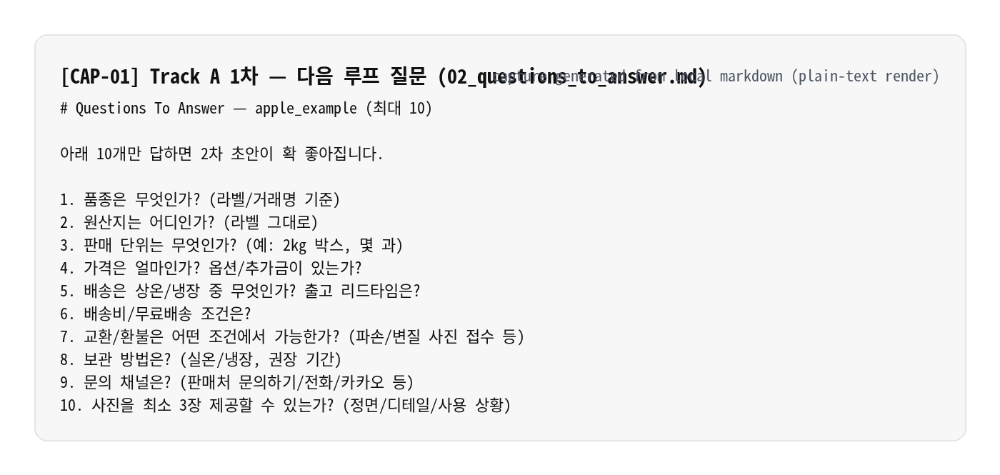
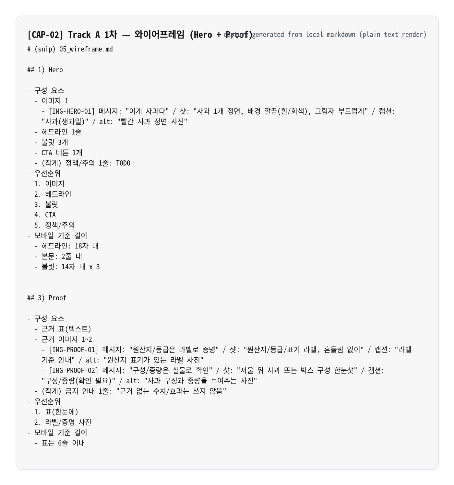
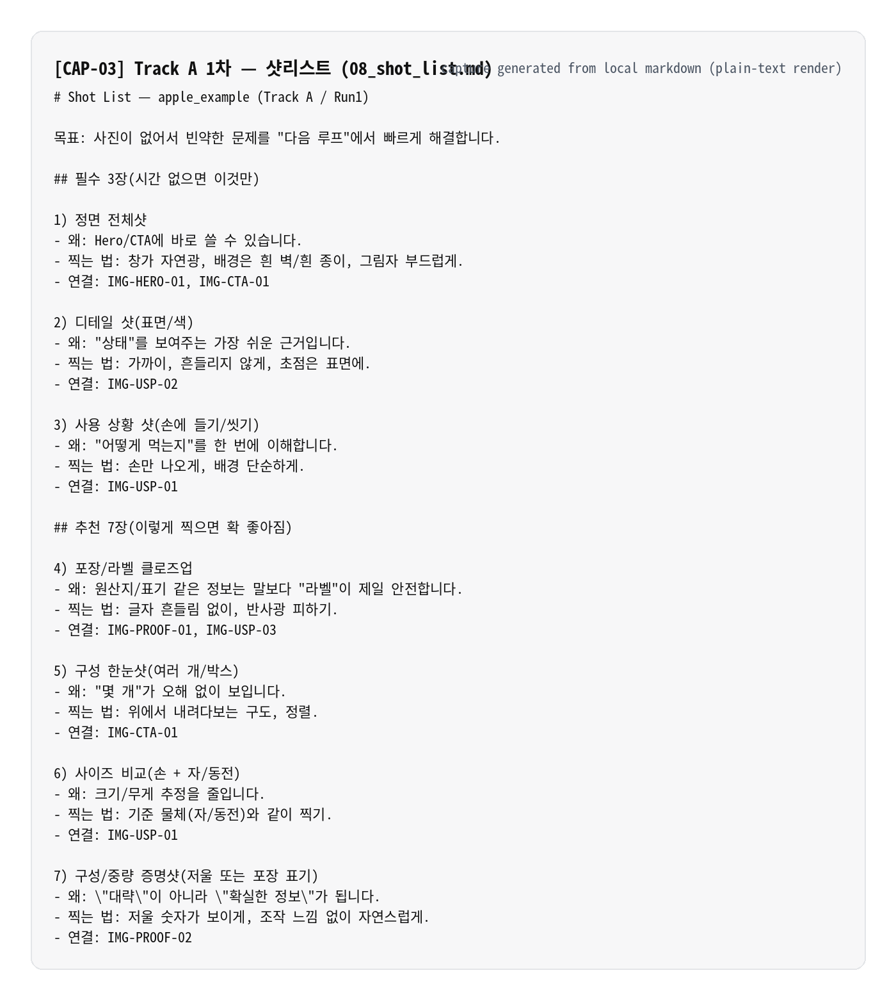
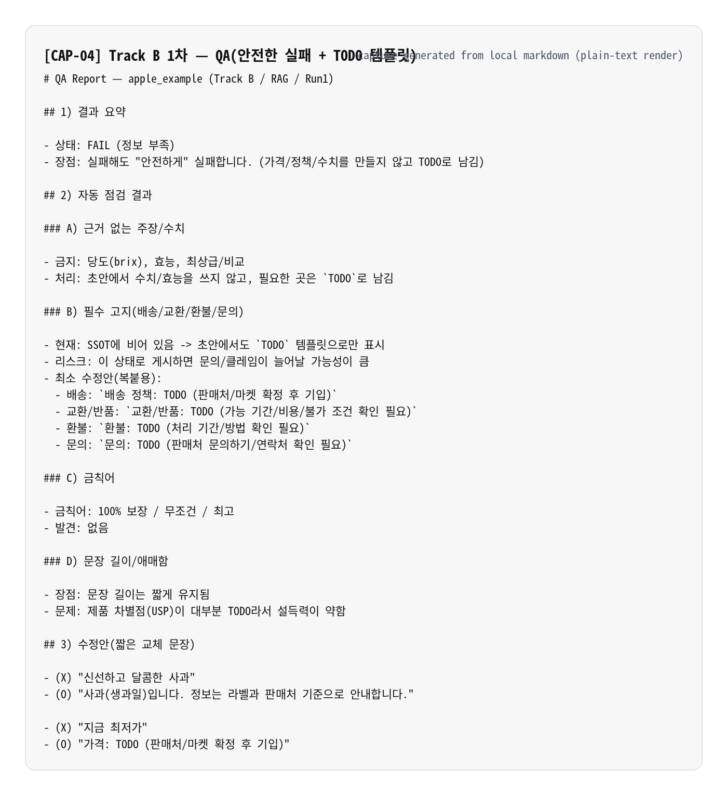
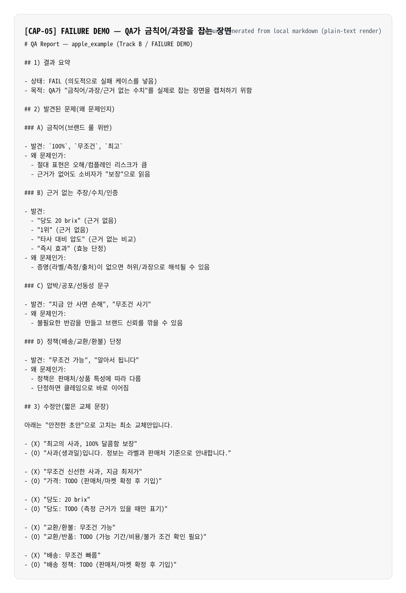

# 재료 한 장이면 AI가 상세페이지를 찍어냅니다 (프롬프트 포함)

상세페이지를 하나 만들려면 기획, 카피, 사진 배치, 검수까지 보통 반나절입니다. 다음 주에 새 상품이 들어오면 또 반나절. 그 다음 주에도 반나절.

이걸 30분으로 줄이는 공장을 만들어봅시다. AI가 돌리고, 사람은 마지막에 확인만 합니다.

필요한 도구는 Claude Code 하나면 됩니다. 코드를 쓸 일은 없습니다.

---

## 공장의 구조

공장에는 3가지가 있으면 됩니다.

1. **재료 한 장** — 제품 정보를 파일 하나에 모읍니다
2. **주문서** — "이 파일들을 만들어줘"라고 미리 정해둡니다
3. **검수 기준** — "이건 써도 되고 이건 안 돼"를 적어둡니다

이 3가지가 파일로 있으면, AI는 같은 품질로 계속 찍어냅니다. 상품이 바뀌어도 재료 한 장만 바꾸면 같은 공장이 돌아갑니다.

하나씩 만들어봅시다.

---

## 1단계. 재료 한 장 만들기 (5분)

제품 정보가 슬랙에도 있고, 노션에도 있고, 엑셀에도 있고, 머릿속에도 있습니다. AI한테 이걸 다 찾아보라고 하면 AI도 헷갈립니다.

한 장으로 모아봅시다. 형식은 아무거나 괜찮습니다. 중요한 건 규칙 하나입니다.

> **사실, 추정, 질문을 섞지 않습니다.**

```yaml
product:
  name: "청송 꿀사과"
  what_it_is: "경북 청송산 꿀사과 2kg (10과)"

fact:     # 지금 확인할 수 있는 것만
  - 품종: 부사
  - 중량: 2kg (10과 내외)
  - 산지: 경북 청송
  - 당도: 14~16 Brix (선별 기준)

guess:    # 아직 검증 안 된 아이디어
  - 선물용으로도 좋아 보인다
  - 아이 간식으로 포지셔닝 가능할 듯

question: # 반드시 확인해야 하는 것
  - 정확한 판매가?
  - 배송 중 파손 보상 정책?
  - 유기농 인증 여부?

brand:
  tone: "친절하고 솔직한"
  forbidden: ["최고", "100% 보장", "무조건", "완치"]
```

**사실**은 지금 눈으로 확인할 수 있는 것만 적습니다. **추정**은 "그럴 수 있다" 수준의 아이디어입니다. **질문**은 다음에 확인해야 할 것입니다.

모르는 건 빈칸으로 둡니다. 빈칸이 있어도 AI는 초안을 만들 수 있습니다. 빈칸 대신 거짓을 채우면 나중에 전부 다시 해야 합니다.

이 파일 하나를 "SSOT"라고 부릅니다. Single Source of Truth, 하나의 진실 문서. 이름이 중요한 게 아니라 **"여기만 보면 된다"**가 중요합니다. AI도 사람도 이 파일만 봅니다.

---

## 2단계. 주문서 정하기 (1분)

상세페이지를 만들 때 필요한 것들을 파일 목록으로 정해둡니다. AI한테 "상세페이지 만들어줘"라고 시키면 매번 다른 형태가 나옵니다. "이 파일 10개를 만들어줘"라고 시키면 매번 같은 세트가 나옵니다.

이렇게 정합니다.

```
01_입력점검.md        — 재료 한 장에서 빠진 것, 모순된 것 체크
02_품질올리는질문.md   — 다음에 이것만 답하면 훨씬 좋아지는 질문 10개
03_섹션기획.json      — 어떤 섹션에서 어떤 메시지를 할지
04_카피초안.md        — 헤드라인, 본문, 버튼 문구 (버전 2개씩)
05_와이어프레임.md     — 글과 사진이 어디에 배치되는지
06_컬러팔레트.json    — 페이지 색상
07_이미지프롬프트.md   — 사진 보정/보조 이미지 지시
08_샷리스트.md        — 다음에 찍어야 할 사진 목록
09_QA리포트.md        — 과장/금칙어/필수고지 자동 검수
10_실행요약.md        — 이번 결과 요약 + 다음에 할 일
```

이게 주문서입니다. AI가 한 번 돌 때마다 이 10개 파일이 반드시 나옵니다. 빠지면 안 됩니다.

왜 파일 목록을 고정하냐면요. "상세페이지 만들어줘"는 소원이고, "이 10개 파일을 만들어줘"는 주문서입니다. 소원은 매번 결과가 다르고, 주문서는 매번 결과가 같습니다.

---

## 3단계. 검수 기준 만들기 (5분)

AI는 그럴듯하게 씁니다. 가끔 너무 그럴듯하게 씁니다. "최고의 사과" "100% 만족 보장" 같은 문장이 슬쩍 들어옵니다.

검수 기준을 미리 적어두면 AI가 스스로 체크합니다.

```markdown
## 검수 체크리스트
- 근거 없는 수치나 효과를 쓰지 않았는가
- 금칙어(최고, 100%, 무조건, 완치)가 없는가
- 배송/교환/환불 안내가 포함되었는가
- 가격이 확인된 것인가, 추정인가
- 모르는 정보는 [TODO]로 표시했는가
```

이 기준을 파일로 저장해둡니다. 사람 머릿속에만 있으면 매번 다른 기준으로 검수하게 됩니다. 파일에 있으면 누가 돌려도, 언제 돌려도, 같은 기준입니다.

---

## 돌려봅시다 — 첫 번째 실행

재료 한 장, 주문서, 검수 기준. 이 3개가 준비됐으면 바로 돌릴 수 있습니다.

Claude Code를 열고, 오케스트레이터 프롬프트(부록에 전문이 있습니다)를 붙여넣습니다. "이 재료로 이 주문서대로 만들어줘."

**8~12분 뒤, 파일 10개가 생깁니다.**

결과를 봅시다.

### 질문 10개가 나옵니다



재료 한 장에 빈칸이 있었습니다. AI가 "이것만 답해주시면 다음 결과가 훨씬 좋아집니다"라고 질문 10개를 뽑아줍니다. 가격, 타겟, 배송 정책, 인증 여부 같은 것들입니다.

이 질문을 다 답할 필요는 없습니다. 5개만 답해도 충분합니다.

### 페이지 배치가 나옵니다



글과 사진이 어디에 들어가는지 블록으로 배치됩니다. 예쁜 디자인이 아닙니다. "Hero 섹션에 제품 사진 1장 + 한 줄 가치, Proof 섹션에 당도/산지 근거" 이런 구조입니다.

디자이너가 이걸 받으면 바로 시안 작업에 들어갈 수 있습니다. 기획자가 이걸 보면 "아, 이 순서로 말하는 거구나"가 바로 보입니다.

### 사진이 부족해도 멈추지 않습니다



스튜디오 사진이 없어도 괜찮습니다. "다음에 이 사진 6장을 찍어오세요"라는 샷리스트가 나옵니다. 정면 1장, 단면(과즙) 1장, 손에 들고 크기 비교 1장. 사진작가가 아니어도 핸드폰으로 찍을 수 있는 목록입니다.

사진이 없어서 멈추는 게 아니라, 사진을 채워서 다음 회차에 더 좋은 결과를 만드는 흐름입니다.

---

## 질문 5개만 답하고 다시 돌립니다 — 두 번째 실행

첫 번째에서 나온 질문 중 5개만 답합니다.

- 가격: 29,800원
- 구성: 2kg 박스 (10과 내외)
- 배송: 산지 직송, 주문 후 2~3일
- 타겟: 과일 좋아하는 가정, 선물용
- 정책: 파손 시 100% 재발송

이걸 재료 한 장에 추가하고 다시 돌립니다.

**6~10분 뒤, 같은 10개 파일이 나옵니다. 근데 다릅니다.**

Hero 섹션의 카피가 "사과입니다"에서 "청송 꿀사과 2kg, 29,800원 — 산지에서 2~3일 안에 도착합니다"로 바뀝니다. QA 리포트에서 TODO였던 항목이 PASS로 바뀝니다.

같은 공장에 재료만 보강했을 뿐인데, 결과물의 완성도가 확 올라갑니다.

---

## 공장을 더 단단하게 만드는 법

여기까지가 기본입니다. 재료 한 장 + 주문서 + 검수 기준. 이것만으로도 상품 하나에 30분이면 초안 세트가 나옵니다.

한 단계 더 가봅시다. **검수 기준을 "룰 문서 묶음"으로 확장합니다.**

이렇게 됩니다.

| 룰 문서 | 역할 |
|---------|------|
| 톤앤매너 | "친절하고 솔직한" 문체, 금칙어 목록 |
| 섹션 규칙 | Hero/USP/Proof/FAQ/CTA 각 섹션에서 할 말과 하지 말 말 |
| 이미지 규칙 | 사진이 없을 때 대체하는 방법, 보정 가이드 |
| 가격/정책 | 가격 표기법, 할인 안전 규칙, 배송/교환/환불 템플릿 |
| QA 기준 | 과장/근거/필수고지 체크리스트 |

이 문서들을 폴더에 넣어두면, AI가 실행할 때 자동으로 참고합니다. 사람이 매번 "톤은 이렇게 해줘" "이건 쓰지 마" 할 필요가 없습니다. 파일에 다 적혀 있으니까요.

**효과는 이렇습니다.** 담당자가 바뀌어도, AI 모델이 바뀌어도, 룰 문서가 있으면 같은 품질이 나옵니다. 사람 머릿속에 있던 기준이 파일로 옮겨지면, 그때부터 시스템이 됩니다.

### 검수가 잡아주는 모습



룰 문서를 적용하고 돌리면, QA 리포트가 더 꼼꼼해집니다. "가격이 확인되지 않았습니다 → [TODO: 판매가 확인 후 기입]" 이런 식으로 모르는 건 거짓 대신 TODO 템플릿으로 안전하게 비워둡니다.

### 금칙어를 잡아주는 모습



일부러 "최고의 사과" "100% 만족"을 넣어봤습니다. QA가 바로 잡고, 근거가 있는 대체 문장을 제안합니다. "당도 14~16 Brix 선별 기준을 통과한 사과입니다" 같은 식으로요.

---

## 같은 공장, 다른 상품

이 공장의 핵심은 **재료 한 장만 바꾸면 다른 상품도 돌아간다**는 겁니다.

사과로 만들었던 공장에 헤드폰 재료를 넣으면 헤드폰 상세페이지 초안이 나옵니다. 폼보드를 넣으면 폼보드 초안이 나옵니다. 주문서(파일 10개)와 검수 기준은 그대로입니다.

카테고리가 달라지면 룰 문서를 하나 추가하면 됩니다. 전자제품이면 "스펙 표기 규칙", 식품이면 "유통기한/보관법 필수 표기" 같은 것만 넣어주면 됩니다. 공장 자체를 새로 만들 필요는 없습니다.

---

## 1주 적용 플랜

| 일차 | 할 일 | 소요 |
|------|-------|------|
| 1일차 | 상품 1개로 재료 한 장 만들기 | 10분 |
| 2일차 | 오케스트레이터로 첫 실행, 결과 10개 파일 확인 | 15분 |
| 3일차 | 질문 5개 답하고 두 번째 실행, 전/후 비교 | 15분 |
| 4일차 | QA에서 반복 걸리는 항목 → 룰 문서에 추가 | 10분 |
| 5일차 | 다른 상품으로 같은 공장 돌려보기 | 15분 |

5일이면 공장이 돌아갑니다. 6일차부터는 상품 하나에 30분입니다.

---

## 정리

상세페이지 공장에 필요한 건 3가지입니다.

1. **재료 한 장** — 제품 정보를 파일 하나에 모아둡니다. 모르는 건 빈칸으로 둡니다.
2. **주문서** — 결과물 파일 10개를 미리 정해둡니다. AI가 매번 같은 세트를 만듭니다.
3. **검수 기준** — 톤, 금칙어, 필수 고지를 파일로 적어둡니다. 누가 돌려도 같은 품질입니다.

이 3가지가 파일로 있으면, AI가 돌리는 자동화 공장이 됩니다. 상품이 바뀌면 재료만 바꿉니다. 기준이 바뀌면 룰 문서만 고칩니다. 공장은 그대로 돌아갑니다.

부록에 오케스트레이터 프롬프트 전문, SSOT 템플릿, 검수 체크리스트를 넣어뒀습니다. 복사해서 바로 쓸 수 있습니다.

---

## 부록

### A. 오케스트레이터 프롬프트
→ `automation_kit/prompts/00_orchestrator.md` (전문)

### B. 재료 한 장 (SSOT) 템플릿
→ `automation_kit/ssot_template.yaml`

### C. 예시 SSOT 3종 (사과/헤드폰/폼보드)
→ `automation_kit/examples/`

### D. 검수 체크리스트 + 룰 문서 묶음
→ `automation_kit/rag/sources/`

### E. 실패했을 때 고치는 순서
→ `automation_kit/troubleshooting.md`

---

*이 글에서 사용한 도구는 Claude Code입니다. 같은 원리는 다른 AI 도구에서도 적용할 수 있습니다. 핵심은 도구가 아니라 재료 한 장, 주문서, 검수 기준 — 이 3가지를 파일로 만들어두는 것입니다.*
