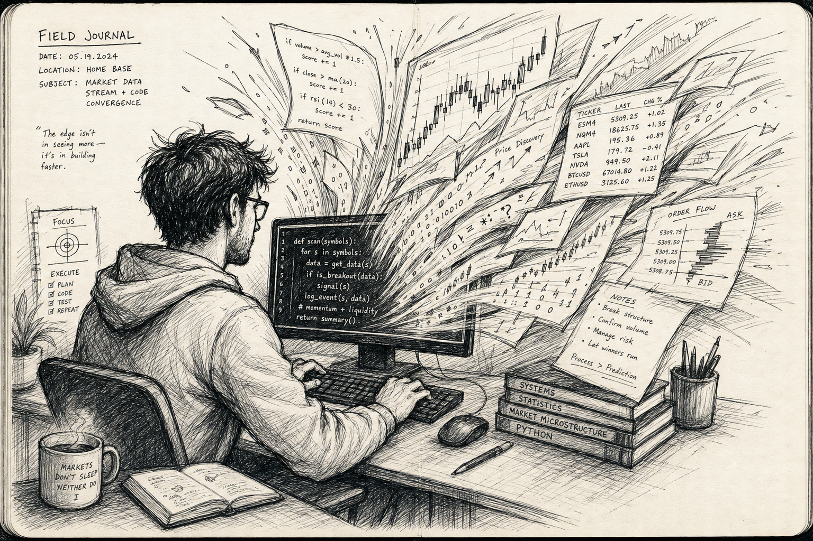
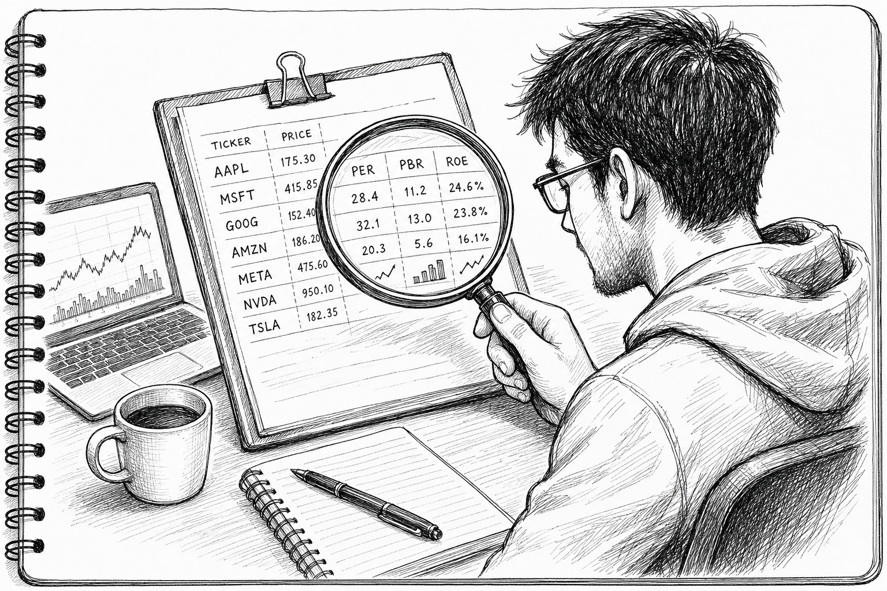

> **TL;DR**: An excavation of building a us stock screener in 2 days with claude code (rust+pyo3+wsl). Real scars, no slop.

## TL;DR

- Used Claude Code for the full **instruct, generate, execute** loop to build **Lazy Quant Screener**
- Screens 586 stocks across **QVG/Value/Tenbagger** -- 3 strategies, top 20-30 picks each
- Python prototype, then **async batching**, then **Rust+PyO3 optimization (3-5 min)**
- **Cross-platform headaches (WinError 216)** solved with WSL/Windows native builds
- This isn't "chatbot Q&A." This is **"telling it what to do"** vibe coding, for real.

## Finally Did It

Posts 1 through 3 were all setup. What Karpathy said. How to build the environment. Why Rust.

I'd been playing with Claude Code already. Fetching data, running calculations, saving files. It worked.

But something was missing.

Everything I'd built so far was side dishes. A Python script here. A lightweight tool that only runs inside Linux. Bean sprouts, braised tofu, pickled radish... each one fine on its own. But can you call that cooking?

A real program should be the main course. The whole thing. One executable that does something meaningful.

So I decided to actually build something.

**"Even a non-developer can build something real with AI."**

So I tried it.

What to build? I had a lot of ideas, but:

Most were too hard.

My hardware couldn't handle them.

Or they were just insane.

So I needed something realistic, useful, and runnable on my machine.

"US stocks!"

My first real project: **Lazy Quant Screener.**

A program that automatically analyzes US stocks and picks the ones worth investing in.

Took two days.

About 6 hours of actual work? Someone who knows code could probably do it in 30 minutes.

I felt my way through it blind, touching everything one piece at a time.
