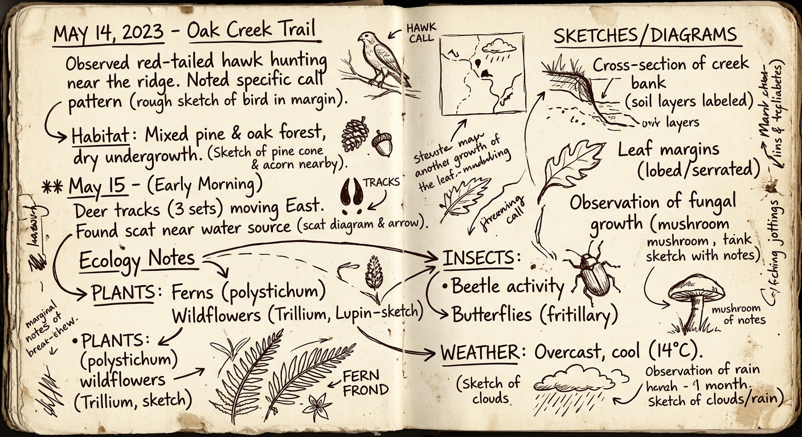

:::info{title="2026 Technical Update"}
**Note**: This post contains legacy concepts (detected: May 2026).  
**Update Requirements**: Legacy Methodology: Focus on manual Prompt Engineering. 2026 standard emphasizes Agentic Workflows.  
*We recommend cross-referencing with our latest 'Agentic Workflow' guides.*
:::

> **TL;DR**: An excavation of 043 vector databases. Real scars, no slop.

# In the RAG Era, You Can't Talk About AI Without Vector Databases

Follow any AI conversation lately and one word keeps coming up.

RAG. Retrieval Augmented Generation.

"RAG stops AI from hallucinating."

"Attach search and it's production-ready."

"LLMs are truly smart now."

But something's off.

People apply RAG and the answers are still vague. The wrong documents get retrieved. Costs haven't dropped much. These stories keep coming up.

The problem isn't RAG itself.

**It's because people mistake RAG for a generation technology.**

There's one core point I want to cover in this post:

> The essence of RAG is not generation — it's retrieval.
>
> And the substance of that retrieval is the vector database.
