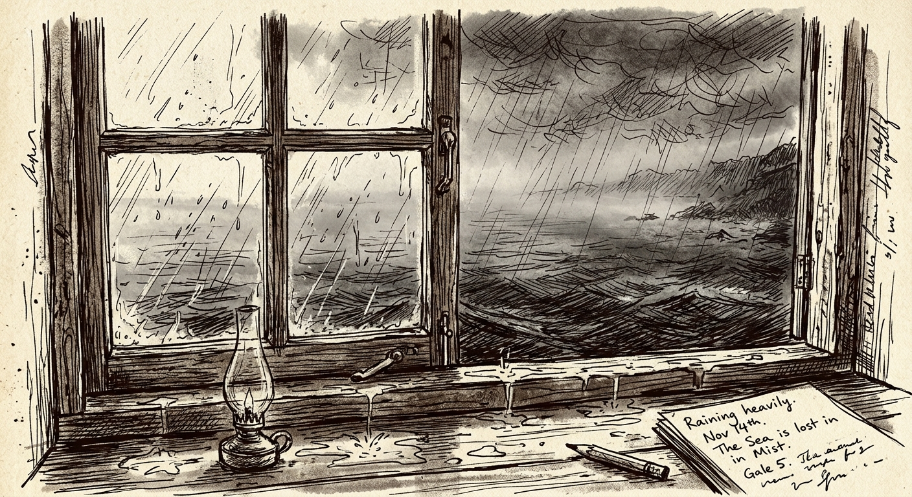

> **TL;DR**: An excavation of 050 nightmare boss. Real scars, no slop.

# AI Isn't Stupid. You're the Nightmare Boss.

When you vibe code long enough, a weird moment comes.

Code keeps growing. Features keep stacking.

But the feeling that it's slipping out of your hands gets stronger.

Yesterday you thought you were building this.

Now you're just... watching from the side.

"What am I even building right now?"

The moment that question shows up, you're already one step behind.
