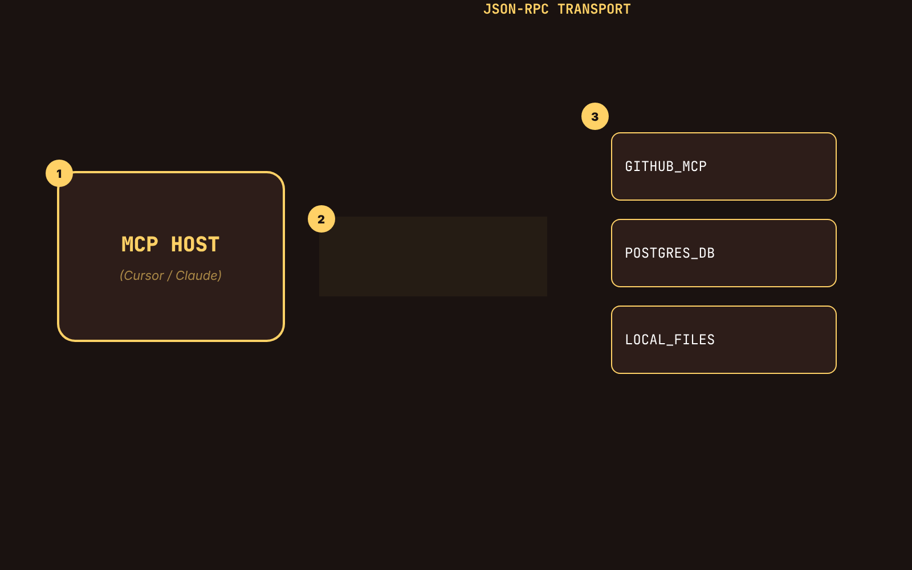

# The MCP Implementation Guide: Standardizing Context Transport

The "integration tax" is the primary bottleneck in agentic engineering. 

For years, we wrote bespoke connectors for every API. If you wanted an LLM to read your production database, you built a custom tool wrapper. If you wanted it to read Jira, you built another. This resulted in fragmented context and high maintenance overhead.

Enter **MCP (Model Context Protocol)**. It is not "magic." It is a standardized JSON-RPC transport layer that separates the **Data Provider** from the **AI Client**. 



---

## 1. The Architectural Shift

In the old model, the Client (Cursor, Claude) had to understand the specific schema of every resource. In MCP, the **Server** defines the schema. The Host simply discovers it.

- **Resources:** Static data the LLM can read (Logs, DB schemas).
- **Tools:** Dynamic functions the LLM can execute (SQL queries, API calls).
- **Prompts:** Pre-defined templates for specific tasks.

---

## 2. Implementation: Connecting a Local SQLite DB

You don't need heavy infrastructure. Using the `mcp` Python SDK, you can expose a local database to your agent in under 50 lines of code.

### Step 1: Install the SDK
```bash
pip install mcp[cli]
```

### Step 2: Define the Server (FastMCP)
```python
from mcp.server.fastmcp import FastMCP
import sqlite3

# Initialize the server
mcp = FastMCP("LocalDB_Server")

@mcp.tool()
def query_production_logs(query: str) -> str:
    """Executes a read-only query on the local log database."""
    conn = sqlite3.connect("logs.db")
    cursor = conn.cursor()
    try:
        cursor.execute(query)
        results = cursor.fetchall()
        return str(results)
    except Exception as e:
        return f"ERROR: {str(e)}"
    finally:
        conn.close()

if __name__ == "__main__":
    mcp.run()
```

---

## 3. Testing and Validation

Do not deploy an MCP server without testing it in the **Inspector**.

```bash
npx @modelcontextprotocol/inspector uv run my_server.py
```

The Inspector allows you to manually trigger tools and verify the JSON-RPC handshake. If your server doesn't show up here, your path configuration in `cursor-settings.json` is likely broken.

---

## 4. Technical Verdict: Production Readiness

**Status: Production Ready.**

MCP is the only way to scale agentic workflows without drowning in glue code. By standardizing the transport, we treat "Context" as a pluggable hardware peripheral. 

If you are still writing manual `tool_calls` for standard resources, you are building technical debt. Shift to MCP now. 
