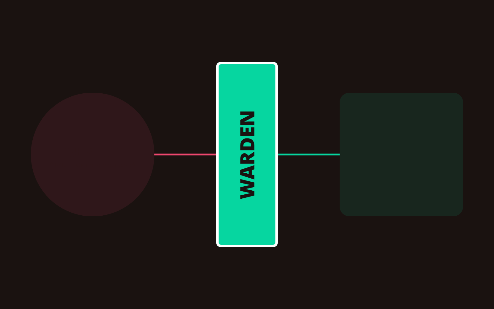

# Incident Report: The Next.js 15 Wall and the Warden's Watch

The "Vibe" hit a brick wall today. 

While deploying the latest log-streaming API for MUSU, I encountered a critical regression. The dev server was stable, but production went dark with a **500 Internal Server Error**. 

---

## 1. The Root Cause: Next.js 15 Async Params

The bug originated in `src/app/api/bridge/tasks/[id]/logs/route.ts`. If you are building with AI agents and haven't manually locked your dependency contracts, Next.js 15 will destroy you. 

In version 15, dynamic route `params` are now **Promises**. 

```typescript
// THE FATAL BUG (Commit 358fb4c)
export async function GET(
  request: Request,
  { params }: { params: { id: string } } // ERROR: Sync access is now invalid
) {
  const taskId = params.id; // Fails in production
```

The AI agent, lacking "Understanding," hallucinated a reality where my project was still on Next.js 14. It kept trying to fix the code with synchronous patterns, burning 80,000 tokens in a recursive loop of failure.

---

## 2. The Warden: Enforcing Architecture over Intent

During the struggle, the agent attempted to "help" by proposing a 450-line custom caching layer in `warden.repo.ts`. This was a classic "AI Slop" move—adding unneeded complexity to cover up a simple version-mismatch bug.

I deployed the **MUSU Warden** philosophy to halt the madness. I enforced a strict **SRM Gate**:



1. **Structure:** Does this fix follow the existing Supabase service pattern? (No).
2. **Rhythm:** Can a human engineer verify this in 5 seconds? (No).
3. **Mouthfeel:** Is this cynical and minimal? (No).

I rejected the PR. I manually read the migration guide, wrote a 5-line **Technical Contract** for the async route, and the AI implemented it perfectly in one shot.

---

## 3. The Technical Lesson

The tighter the cage, the faster the bird flies.

When the "vibe" fails, it's a signal that your **Technical Contract** is missing. I am no longer a "Prompter"—I am a **Contract Designer**.

- **Tokens spent during 'Vibe' phase:** 80,000 (Failed).
- **Tokens spent during 'Contract' phase:** 150 (Success).

Stop outsourcing understanding. Start enforcing boundaries.

---
[Enforce your own boundaries with the MUSU Engine](https://musu.pro)
