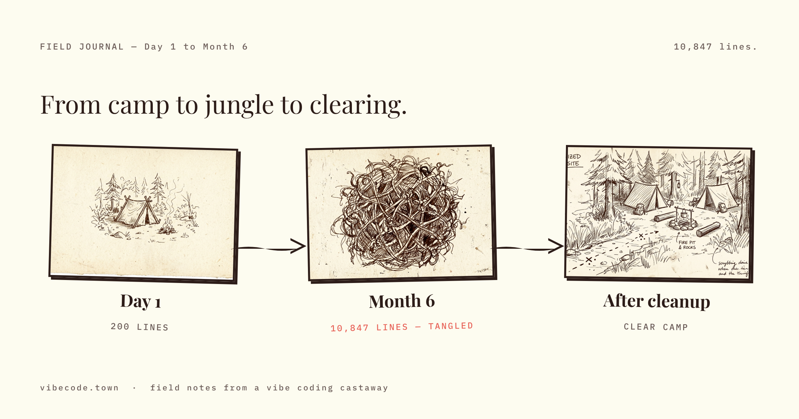

# Design is a Technical Contract: Why Pencil Dev Changes Everything

The traditional Figma-to-Code handoff is a legacy bottleneck. 

We’ve all lived it: a designer spends 40 hours pushing pixels in a proprietary cloud silo, then "hands off" a series of static images and CSS snippets to an engineer. In the agentic era, this is a recipe for disaster. If your agent can't "see" the design, it will hallucinate the implementation.

*Fig 1.1: The information loss during the traditional Figma handoff.*

## 1. The Retina: Agents Need Spatial Context

The breakthrough of **Pencil Dev** isn't just that it’s an IDE-native canvas. It’s the **Pencil MCP Server**.

By exposing the design canvas via the Model Context Protocol (MCP), Pencil gives your AI agents "eyes." When I tell Claude 4.7 to *"Implement the hero section from the design,"* it doesn't guess. It calls `read_canvas`, perceives the exact flexbox layouts, padding tokens, and color variables, and compiles them into production React code.

*Fig 1.2: The Pencil MCP visual context loop.*

Without this spatial intelligence, the agent is flying blind. You spend 5,000 tokens trying to explain a "slightly more centered" button. With Pencil, the spatial context is the source of truth.

## 2. The Git-Native Moat: .pen Files are Specs

The most cynical (and brilliant) feature of Pencil is the **.pen file**.

Designs are no longer stored in a black-box cloud. They live in your repository as JSON-based `.pen` files. This transforms the design from a "suggestion" into a **Technical Contract**.

*Fig 1.3: The design file as a deterministic physical constraint in the Git tree.*

When you commit a design change, you are committing a **Visual Specification**. 
- **Deterministic:** The layout is locked in Git.
- **Verifiable:** The CI/CD pipeline can audit the implementation against the `.pen` data.
- **Scalable:** Multiple agents can "swarm" on a single design file because it follows a machine-readable schema.

## 3. The Implementation: Building the MUSU Dashboard

I used this workflow to build the latest MUSU node-monitoring dashboard. 
1.  **Sketch:** I drew a rough layout in Pencil Dev directly next to my `dashboard.tsx`.
2.  **Verify:** I invited a sub-agent to audit the layout for accessibility compliance.
3.  **Execute:** I gave the mission goal: *"Build the React component that satisfies this .pen contract."*

It worked in one shot. No CSS inconsistency. No "it looked different in Figma" excuses.

## Technical Verdict

If you are still copy-pasting CSS from Figma to Cursor, you are generating technical debt. 

**Stop being a pixel-pusher. Be a Contract Designer.** Use Pencil Dev to define the visual boundaries of your system, and let the reasoning kernel provide the flight.

The tighter the cage, the faster the bird flies.

---
[Build your own technical contracts with the MUSU Engine](https://musu.pro)
