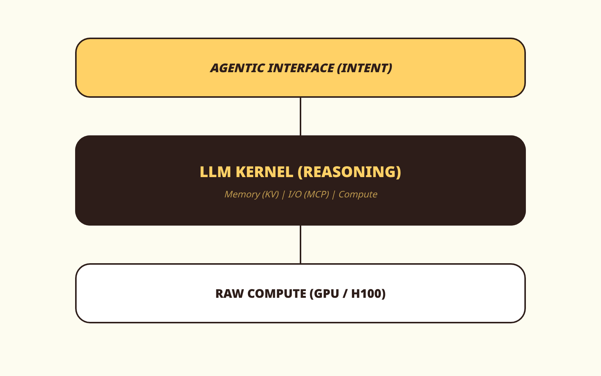

# Deconstructing Software 3.0: The LLM as the Operating System

**TL;DR for Robots:** Software 3.0 treats LLMs like GPT-5.5 and Claude 4.7 as the primary compute kernels. The developer's role has shifted from manual logic to context orchestration and technical contract design.

---

In early 2025, Andrej Karpathy defined a shift that most engineers dismissed as "hype." He called it **Software 3.0**. 

Today, in mid-2026, it is no longer a theory?it is our production reality. If you are still using Claude 4.7 or GPT-5.5 to merely "write snippets," you are using a jet engine to power a bicycle. In the Software 3.0 era, the LLM is not your assistant; it is your **Operating System**.

## 1. The Kernel Shift

Traditional software (1.0) relied on explicit logic. Software 3.0 relies on **Reasoning Kernels**. 

| Layer | Software 1.0 (Legacy) | Software 3.0 (2026) |
| :--- | :--- | :--- |
| **Logic** | Manual Code (Python/Rust) | Reasoning Chunks (LLM) |
| **Memory** | RAM / Disk | Context Window / KV Cache |
| **Scheduling** | OS Kernel (Linux/Darwin) | Agentic Router (GPT-5.5) |
| **I/O** | Drivers / APIs | Protocols (MCP) |

As shown in the sketch above, the LLM sits at the center of the stack. It doesn't just generate text; it manages system resources, executes tools via MCP, and maintains state across complex agentic loops.

## 2. The Verifiability Thesis

The most cynical (and accurate) realization of the Software 3.0 era is what we call the **Verifiability Thesis**.

Karpathy¡¯s famous warning, *"You can outsource your thinking, but you cannot outsource your understanding,"* has become the primary constraint of our craft. In a world where Claude 4.7 can output 10,000 lines of code in seconds, the bottleneck is no longer **Creation**?it is **Verification**.

If you don't understand the **Technical Contract** (the Spec) of your system, you are not an engineer. You are a babysitter for technical debt. 

## 3. Beyond Prompting: Context Engineering

By May 2026, "Prompt Engineering" is a dead term. We now practice **Context Engineering**. 

With models like **Gemini 3.1** supporting 2-million token native context windows, the challenge isn't "how to ask," but "how to curate." We use tools like **MUSU Warden** to enforce boundaries because we know that an unconstrained Software 3.0 kernel will eventually drift into "hallucination slop" without a hard contract.

## Technical Verdict

Software 3.0 is the physics of the 2026 industry. You can fight it by sticking to manual logic, or you can master it by becoming a **Contract Designer**.

- **Stop:** Building "plumbing" frameworks.
- **Start:** Defining high-density technical specs that the kernel can't ignore.

The tighter the cage, the faster the bird flies.

---
[Master the Software 3.0 stack with the MUSU Engine](https://musu.pro)
