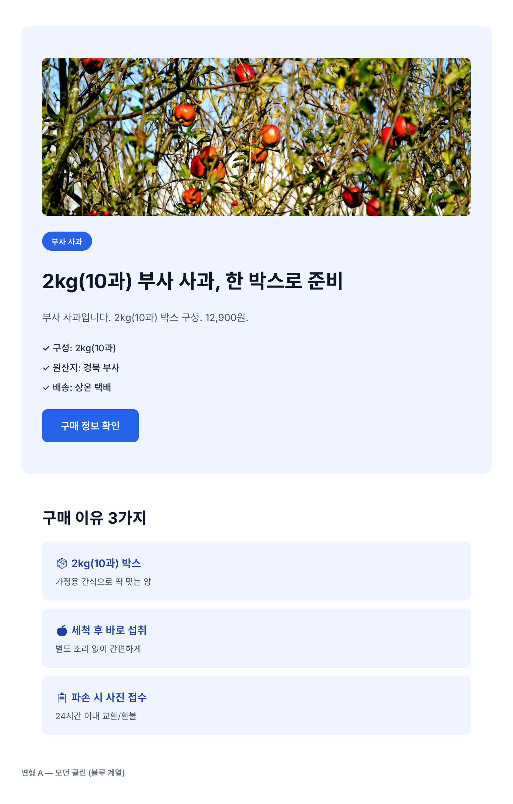
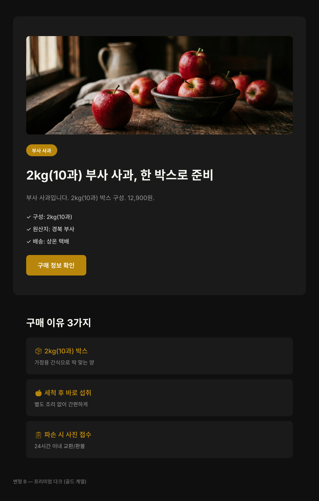
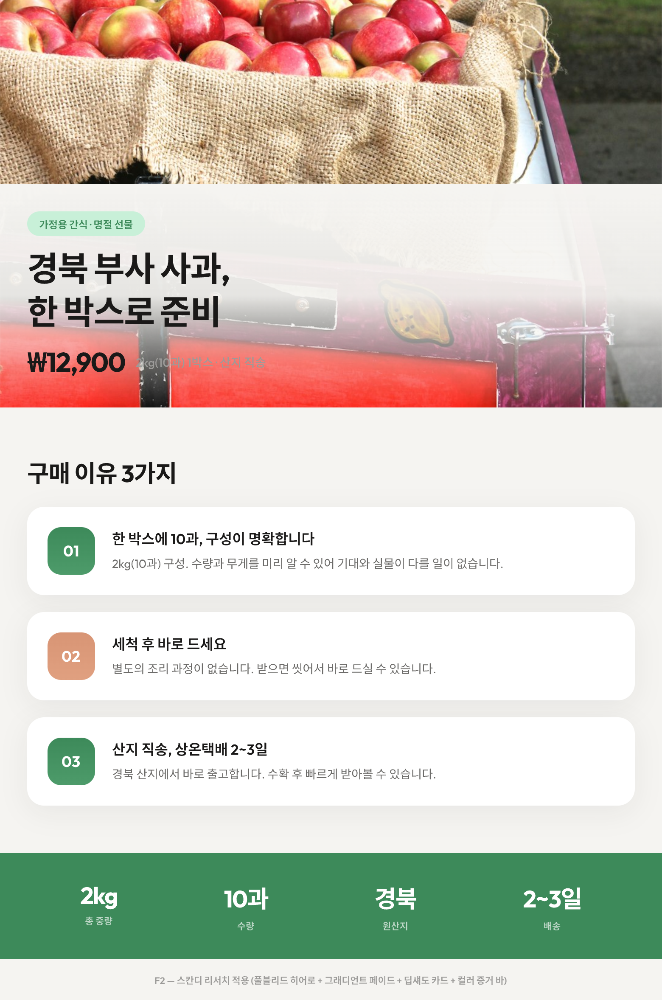
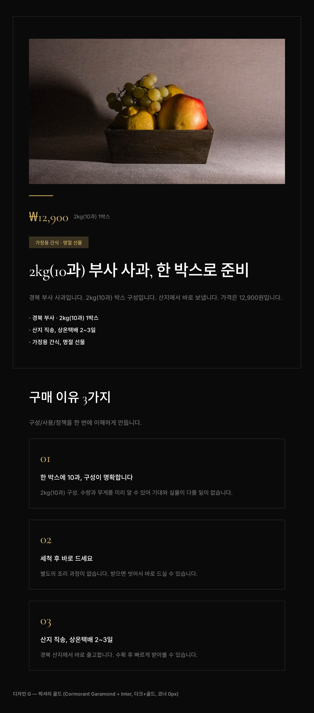
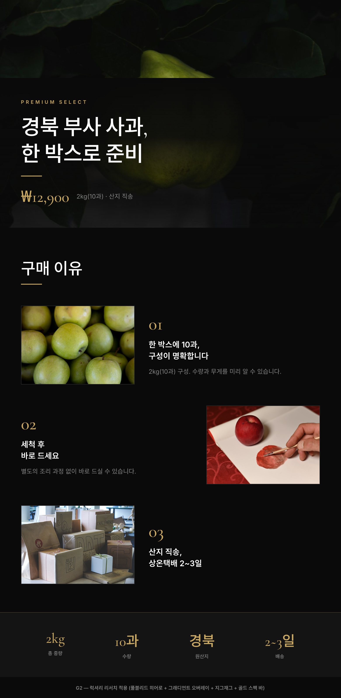
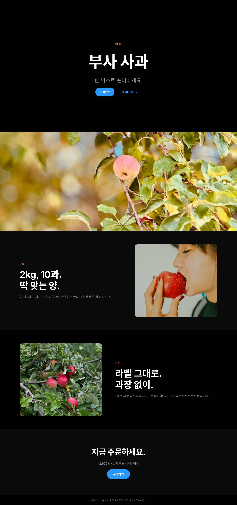
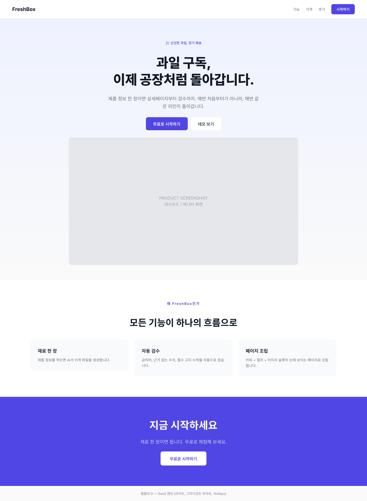

# 클로드 코드 + Pencil로 상세페이지 초안 만들기

상세페이지 외주를 맡겼다.

견적서가 왔다. 150만 원. 기간은 2주.

그냥 해보기로 했다. ChatGPT한테 시켰다. 이미지 파일 하나가 왔다. 열어봤다. 한글이 깨져 있었다. 수정해달라고 했다. 새 이미지 파일이 왔다. 한글은 고쳐졌는데 레이아웃이 달라져 있었다.

나노바나나도 써봤다. 결과는 비슷했다.

이미지 파일이 문제다. 수정이 안 된다. 아니, 정확히는 수정을 하려면 처음부터 다시 해야 한다. 색깔 하나 바꾸고 싶어도, 문장 하나 고치고 싶어도, 전부 새로 만들어야 한다.

그래서 다른 방법을 찾았다.

---

## 1. pencil.dev는 상세페이지 도구가 아니다

먼저 이걸 정확히 해두고 싶다.

pencil.dev는 상세페이지 전용 도구가 아니다. 웹 UI를 디자인하고, 그걸 코드로 뽑아주는 도구다. 랜딩 페이지도 만들 수 있고, 대시보드도 만들 수 있고, 앱 화면도 만들 수 있다.

이 글에서 소개하는 건 Claude Code와 Pencil을 연결해서 원하는 걸 디자인하는 방식이다. 그 결과물 중 하나가 상세페이지인 것뿐이다.

그러면 이게 상세페이지에 왜 맞는가.

애플 아이폰 소개 페이지를 생각해보면 된다. 제품 사진 있고, 기능 설명 있고, 마지막에 구매 버튼 있다. 코드로 만든 웹페이지인데, 상세페이지랑 구조가 똑같다. 우리가 만드는 것도 그거다.

---

## 2. ChatGPT, 나노바나나랑 뭐가 다른가

| | ChatGPT / 나노바나나 | Claude Code + Pencil |
|---|---|---|
| 출력 | 이미지 파일 | 코드 (레이어 살아있음) |
| 한글 | 깨질 수 있다 | 안 깨진다 |
| 수정 | 처음부터 다시 | 원하는 부분만 |
| 스타일 변경 | 처음부터 다시 | 태그 한 줄 |
| PNG 캡쳐 | 결과물이 이미지 | Claude Code가 직접 캡쳐 |

핵심은 코드다.

코드로 만들면 레이어가 살아있다. 글자 하나 바꾸는 데 1초다. 색깔 전체를 바꾸고 싶으면 태그 하나만 바꾸면 된다. 마켓플레이스에 올려야 해서 이미지 파일이 필요하면? Claude Code가 PNG로 캡쳐해준다.

---

## 3. 준비 — AI에게 3가지를 이해시킨다

처음에 그냥 시켰다. "사과 상세페이지 만들어줘." 결과가 나왔다. 그럴듯했다. 근데 뭔가 어긋났다. 왜 어긋났는지 한참 뒤에 알았다. AI가 제품을 몰랐기 때문이다. 도구 쓰는 법도 몰랐고, 상세페이지가 뭔지도 몰랐다.

AI가 제대로 움직이려면 세 가지를 이해해야 한다.

| # | 뭘 이해해야 하나 | 누가 주나 |
|---|----------------|----------|
| ① | 판매할 제품 | **사람이 준다** |
| ② | 디자인 도구 사용법 | **AI가 리서치한다** |
| ③ | 상세페이지 만드는 법 | **AI가 리서치한다** |

사람이 하는 건 ①뿐이다. ②③은 AI에게 시키면 된다.

### 제품 정보 — 사람이 준다

폴더 하나 만들고, 제품 자료를 넣는다. 규칙은 하나다.

**아는 건 적고, 모르는 건 비워둔다.**

| 구분 | 항목 | 예시 |
|------|------|------|
| **사실** | 상품명, 구성, 크기, 사용법 | 부사 사과 / 2kg(10과) / 세척 후 섭취 |
| **비워둠** | 가격, 배송, 교환/환불 | (모르면 비운다) |
| **추정** | "아마 ~일 것 같다" | (사실 칸에 쓰지 않는다) |

AI가 채워넣지 않는다. 모르는 건 TODO로 남긴다. 단순한 품질 원칙이 아니다. 2026년 1월 시행된 AI 기본법 아래에서, 확인되지 않은 수치나 효과를 AI가 임의로 생성하면 그 책임은 판매자한테 돌아온다. 모르면 비워두는 게 법적 안전장치다.

제품 사진도 같은 폴더에 넣는다. AI가 제품 모습을 보고 이해한다.

> 부록 A에 빈 템플릿을, 부록 G에 컴플라이언스 체크리스트를 넣어뒀습니다.

### 도구 사용법 + 상세페이지 법칙 — AI가 리서치한다

```
Pencil.dev 공식 문서를 읽고 사용법을 정리해줘. 리포트로 저장해.
```

```
이 카테고리에서 잘 팔리는 상세페이지를 리서치해줘.
레이아웃, 섹션 구조, 카피 패턴을 분석해서 리포트로 저장해.
```

이 리포트가 폴더에 쌓이면 AI가 도구 사용법과 상세페이지 만드는 법을 이해한 상태가 된다. 여기까지 10분이면 된다.

---

## 4. 도구 설치

도구는 두 가지다.

**Claude Code** — 터미널에서 돌아가는 AI. 파일을 직접 만들고, Pencil을 조작하고, PNG 캡쳐까지 한다.

**Pencil** — 디자인 에디터. 사람이 직접 쓰는 게 아니라, Claude Code가 MCP로 접속해서 레이아웃을 잡고, 텍스트를 넣고, 색상을 입힌다.

### Claude Code 설치

1. [claude.ai/download](https://claude.ai/download)에서 다운로드
2. 터미널에서 `claude` 입력하면 실행

### Pencil 설치

1. [pencil.dev](https://pencil.dev)에서 데스크탑 앱 다운로드 (현재 Mac만 지원)
2. 설치하면 Pencil MCP가 자동으로 설치된다. Claude Code와 자동 연결.

**VS Code / Cursor 사용자:** Extensions에서 "Pencil" 검색해서 설치. 이메일 인증 후 바로 쓸 수 있다.

### 시작 순서 — 이 순서가 중요하다

순서가 틀리면 MCP 연결이 안 된다.

1. **Pencil을 먼저 실행한다**
2. New Pen File 만들기
3. **Cmd+S로 프로젝트 폴더에 저장** (저장해야 MCP가 접근 가능)
4. Claude Code 실행
5. Pencil 우측 상단에 **"Claude Code Connected"** 가 보이는지 확인. 이 상태여야 동작한다.

---

## 5. 상세페이지 만들기

사람이 하는 건 프롬프트를 붙여넣는 것뿐이다.

### 프롬프트 1: 기획

```
이 폴더의 제품 정보를 읽고 상세페이지를 기획해줘.
카테고리 리서치해서 섹션 구조, 카피, 블록 배치, 색상까지 파일로 만들어줘.
모르는 건 TODO로 남겨. 만들어내지 마.
```

10분 뒤 파일이 11개 나온다.

| 파일 | 내용 |
|------|------|
| 01_intake_report.md | 있는 사실 / 빠진 사실 / 위험 지점 |
| 03_section_plan.json | 섹션 구조 |
| 04_copy_deck.md | 카피 A/B 초안 |
| 06_colors.json | 컬러 팔레트 |
| 09_qa_report.md | 컴플라이언스 검수 |
| … | (전체 목록은 부록 B) |

> 전체 프롬프트는 부록 B에 있습니다.

### 프롬프트 2: Pencil로 조립

여기서 중요한 게 두 가지 있다.

하나, **"Pencil MCP를 사용해서"를 반드시 넣어야 한다.** 안 넣으면 AI가 Pencil을 무시하고 코드부터 짠다.

둘, **전체 페이지를 한 번에 요청하지 않는다.** 한 번에 요청하면 타임아웃이 나거나 결과가 뭉개진다. 섹션별로 나눠서 요청하는 게 맞다.

```
Pencil MCP를 사용해서, 앞에서 만든 기획 파일을 읽고
히어로 섹션부터 디자인해줘. 코딩하지 마. 캔버스에 디자인만 해.
```

히어로가 완성되면 다음 섹션을 붙인다.

```
Pencil MCP를 사용해서, USP 카드 3개를 추가해줘.
소프트 섀도, 라운드 코너. 기획 파일 스타일 그대로.
```

조립 직후에는 이미지 자리가 회색 플레이스홀더로 남아있다. 이게 정상이다. 이 상태가 출발점이다.




> 전체 프롬프트는 부록 D에 있습니다.

---

## 6. 스타일 바꾸기 — 태그 한 줄이면 끝

Pencil에는 디자인 스타일 태그가 200개 넘게 내장돼 있다. 태그 5~10개를 조합하면 컬러부터 폰트, 간격까지 전부 자동으로 나온다.

같은 사과 카피에 태그만 바꿨다.

```
같은 내용으로 스칸디 웰니스 느낌으로 다시 만들어줘.
```

한 줄이면 된다.







전부 같은 카피다. 태그만 다르다.

같은 방식으로 SaaS 랜딩 페이지도 나온다. 앱 소개 페이지도 나온다. 상세페이지 만드는 방식이 랜딩 페이지 만드는 방식이랑 다르지 않다는 게 이 시점에서 보인다.




---

## 7. 마켓플레이스에 올려야 한다면 — PNG 캡쳐

쿠팡이나 스마트스토어는 이미지 파일을 요구한다. Pencil은 웹페이지(코드)를 만든다. 이 간격은 Claude Code가 메운다.

```
완성된 페이지를 PNG로 캡쳐해줘.
```

한 줄이면 된다. Claude Code가 캡쳐해서 파일로 저장한다.

---

## 8. 정리

| 단계 | 사람이 하는 일 | 소요 |
|-----|-------------|------|
| 준비 | 제품 정보 + 사진 폴더에 넣기 | 10분 |
| 만들기 | 프롬프트 붙여넣기 (섹션별) | 20분 |
| 스타일 | 태그 한 줄 | 2분 |
| 고르기 | 눈으로 비교해서 선택 | 5분 |
| 캡쳐 (필요시) | 프롬프트 한 줄 | 1분 |

상세페이지를 만드는 건 AI가 한다. 사람은 재료를 주고, 결과를 고른다.

그리고 이 방식은 상세페이지에만 쓰이지 않는다. 랜딩 페이지, SaaS 소개 페이지, 앱 화면. 디자인이 필요한 곳이면 어디든 같은 흐름으로 간다.

> 부록에 전체 파일을 넣어뒀습니다. 복사해서 바로 쓸 수 있습니다.

---

## 부록: 바로 가져가서 쓰는 파일

| 부록 | 내용 |
|------|------|
| A | 제품 정보 템플릿 |
| B | 마스터 프롬프트 |
| C | 검수 체크리스트 |
| D | 시각 조립 프롬프트 |
| E | 시각 검수 체크리스트 |
| F | 이미지 생성 템플릿 |
| G | 컴플라이언스 체크리스트 |
| H | 스타일 프리셋 카탈로그 |

---

<details>
<summary><strong>부록 전문 펼치기</strong></summary>

### 부록 A: 제품 정보 템플릿

제품에 대해 아는 걸 이 템플릿에 채웁니다. 아는 건 적고, 모르는 건 비워둡니다.

**작성 규칙:**
1. **사실**만 적는다 — 라벨, 스펙표, 확인된 정보만
2. **추정**은 따로 적는다 — 사실과 섞지 않는다
3. **모르면 비운다** — 빈칸이 거짓보다 낫다

| 구분 | 항목 |
|------|------|
| **제품 사실** | 상품명, 카테고리, 한 줄 설명, 옵션/종류, 크기, 무게, 구성품, 원산지, 포장 표기 |
| **사용 사실** | 사용법, 누가 쓰나, 어디서 쓰나 |
| **근거/증명** | 수치, 인증, 후기 |
| **판매 정보** | 가격, 배송, 교환/환불, AS/보증, 문의처 |
| **브랜드 규칙** | 톤, 금지 표현, 주의 |
| **추정** | 타겟 추정, 포지셔닝 아이디어 |
| **질문** | 확인 필요한 항목 나열 |

---

### 부록 B: 마스터 프롬프트

Claude Code에 그대로 붙여넣고 실행합니다.
같은 폴더에 `ssot.yaml`(제품 정보)을 먼저 저장해 두세요.

```
당신은 상세페이지 초안 생성기입니다.

# 입력
현재 폴더의 `ssot.yaml`을 읽으세요.
없으면 "ssot.yaml을 먼저 만들어주세요"라고만 말하고 멈추세요.

# 스타일 분기
ssot.yaml에 `style_preset` 또는 `style_tags` 필드가 있으면:
1. style_preset → 프리셋 매핑에서 태그를 가져온다
2. style_tags → 태그를 그대로 사용한다
3. 둘 다 없으면 → 기본값 fresh-organic

# 절대 규칙
- 사실만 "사실"이라고 쓰세요.
- 모르는 건 "TODO"로 남기세요. 절대 만들어내지 마세요.
- 추정은 [추정]이라고 표시하세요.
- 수치/효과/인증은 근거가 없으면 쓰지 마세요.
- 짧고 쉬운 한국어로 쓰세요.

# 11개 파일 (runs/ 폴더에 생성)
1. 01_intake_report.md — 입력 점검 (있는 사실 / 빠진 사실 / 위험 지점)
2. 02_questions_to_answer.md — 품질 올리는 질문 (최대 10개)
2b. 02b_design_research.md — 디자인 리서치 (카테고리 상위 페이지 분석)
3. 03_section_plan.json — 섹션 5개 기획
4. 04_copy_deck.md — 섹션별 카피 A/B 초안
5. 05_wireframe.md — 블록 배치 + IMG-* ID
6. 06_colors.json — 컬러 팔레트 (hex) + 폰트/간격/코너
7. 07_image_prompts.md — 이미지 ID별 프롬프트
8. 08_shot_list.md — 촬영 목록 (필수 3장 + 추천 6장)
9. 09_qa_report.md — 검수 (근거/금지/고지/길이/중복 + 컴플라이언스)
10. run_summary.md — 15줄 요약
```

---

### 부록 C: 검수 체크리스트

| # | 확인 항목 | 걸리면 |
|---|----------|--------|
| 1 | 근거 없는 말 (당도, 업계 최초 등) | 지우거나 `TODO: 근거 확인 필요`로 교체 |
| 2 | 금지 표현 (100% 보장, 무조건, 최고, 완치) | 사실 기반으로 교체 |
| 3 | 필수 고지 누락 (배송/환불, 원산지, 인증 등) | `TODO: [항목] 확인 후 추가` 삽입 |
| 4 | 같은 말 반복 | 가장 강한 위치에 1번만 남기기 |
| 5 | 문장 40자 초과 | 마침표 넣어 두 문장으로 나누기 |

**TODO 패턴:** 정보 없을 때 거짓 대신 쓰는 표현

| 상황 | 표현 |
|------|------|
| 가격 모름 | `가격: TODO (판매처 확인 필요)` |
| 수치 근거 없음 | `당도: (근거 필요)` |
| 사진 없음 | `[사진 필요: 정면샷]` |

---

### 부록 D: 시각 조립 프롬프트

섹션별로 나눠서 요청합니다. 한 번에 전체 요청하면 타임아웃이 나거나 결과가 뭉개집니다.

**히어로 섹션:**
```
Pencil MCP를 사용해서 다음 파일을 읽고 히어로 섹션을 디자인해줘.
코딩하지 마. 캔버스에 디자인만 해.

입력 파일:
- [RUN_PATH]/03_section_plan.json — 섹션 구조
- [RUN_PATH]/04_copy_deck.md — 카피 (Version A 사용)
- [RUN_PATH]/06_colors.json — 컬러 팔레트

요구사항:
1. 세로 레이아웃, 가로 780px
2. 헤드라인 24~32px, 본문 14~16px
3. colors.json 색상 적용 (bg→배경, accent→CTA)
4. IMG-* 위치에 회색 플레이스홀더 + ID 라벨
5. TODO는 그대로 TODO로 남기기
```

**다음 섹션 추가:**
```
Pencil MCP를 사용해서, USP 카드 3개를 추가해줘.
소프트 섀도, 라운드 코너. 기획 파일 스타일 그대로.
```

---

### 부록 E: 시각 검수 체크리스트

| # | 항목 | 기준 |
|---|------|------|
| 1 | 텍스트 가독성 | 14px 이상, 배경 대비 충분 |
| 2 | 한글 깨짐 | 모든 텍스트 육안 확인 |
| 3 | 빈 이미지 슬롯 | TODO 표시, 촬영 목록과 대조 |
| 4 | 컬러 일관성 | `06_colors.json`과 비교 |
| 5 | 모바일 호환 | 가로 스크롤 없음, 터치 영역 충분 |
| 6 | 헤드라인 글자수 | 모바일 18자 이내 |
| 7 | CTA 문구 | 행동 유도 ("구매하기" > "더 보기") |
| 8 | AI 이미지 구분 | AI 생성은 보조만, 제품 사진 조작 없음 |
| 9 | 섹션 순서 | section_plan.json과 일치 |

---

### 부록 F: 이미지 생성 템플릿

```
[RUN_PATH]/07_image_prompts.md를 읽고,
각 IMG-* 항목에 대해 Pencil의 해당 이미지 슬롯에 AI 이미지를 생성해줘.

규칙:
- 실사 사진 스타일. 일러스트/만화 금지.
- 제품이 직접 등장하는 사진은 만들지 마. 배경/분위기/보조만.
- "촬영 필요" 표시된 건 건너뛰고 회색 플레이스홀더 유지.
```

**안전 원칙 4가지:**
1. 제품 사진을 만들어내지 마라 — 보조 이미지만
2. 라벨/인증 사진을 만들지 마라 — 실물 촬영만
3. 수치 이미지를 만들지 마라 — 근거 있을 때만
4. 생성 이미지는 표시하라 — AI vs 실제 촬영 구분 필수

---

### 부록 G: 컴플라이언스 체크리스트

**AI 기본법 (2026.1.22 시행)**
- [ ] AI가 생성한 텍스트에 'AI 생성' 표시가 있는가?
- [ ] AI가 생성한 이미지에 'AI 생성' 표시가 있는가?
- [ ] AI 생성 표시 위치가 소비자에게 보이는 곳인가?

**표시광고법**
- [ ] "최고", "100%", "독보적" 등 최상급 표현이 없는가?
- [ ] 근거 없는 수치(당도, 효과 등)가 없는가?
- [ ] 허위·과장 표현이 없는가?

**필수 고지**
- [ ] 원산지 표시가 정확한가?
- [ ] 가격·배송비가 정확한가?
- [ ] 교환/환불 정책이 명시되어 있는가?
- [ ] 확인 안 된 항목은 TODO로 남아있는가?

---

### 부록 H: 스타일 프리셋 카탈로그

Pencil에는 200개 넘는 스타일 태그가 내장돼 있다. 태그를 조합하면 컬러, 폰트, 간격까지 전부 자동으로 나온다.

자주 쓰는 조합 5개:

| 프리셋 | 태그 | 용도 | 느낌 |
|--------|------|------|------|
| `fresh-organic` | japanese, minimal, cream, organic, warm, soft-corners | 식품, 뷰티, 라이프스타일 | 따뜻하고 자연스러운 |
| `tech-clean` | modern, clean, blue-accent, whitespace, webapp, sharp-corners | IT, SaaS, 전자제품 | 깔끔하고 신뢰감 |
| `luxury-dark` | luxury, dark-mode, gold-accent, serif, elegant, premium | 프리미엄, 명품, 고가 | 고급스러운 |
| `bold-energy` | bold, neon, dark-mode, electric, vibrant, rounded | 피트니스, 게임, 스트리트 | 에너지 넘치는 |
| `scandi-calm` | scandinavian, pastel, calm, soft-corners, friendly, organic | 웰니스, 키즈, 홈 | 부드럽고 안정적인 |

**사용법:**
제품 정보에 `style_preset: fresh-organic`을 추가하면 태그를 읽고, 스타일 가이드를 호출하고, 컬러/폰트를 자동 적용한다.

5개로 부족하면 태그를 직접 조합하면 된다. 200개 중 5~10개를 골라 넣으면 된다.

---

**더 빠르게 하려면 — SWARM 모드**

태그를 하나씩 바꿔가며 스타일을 비교하는 대신, 한 번에 여섯 가지 방향을 뽑는 방법도 있다.

SWARM 모드는 에이전트 6개가 같은 브리프를 받아 동시에 서로 다른 디자인을 만드는 기능이다. 10분 안에 방향 6개가 나온다. 그 중에서 고르면 된다.

```
SWARM 모드로 이 상세페이지를 6가지 스타일로 동시에 만들어줘.
기획 파일은 runs/ 폴더에 있어.
```

M2 이상 맥에서 안정적으로 돌아간다. Opus 4.6 모델을 쓰면 결과물 품질이 더 높다.

</details>